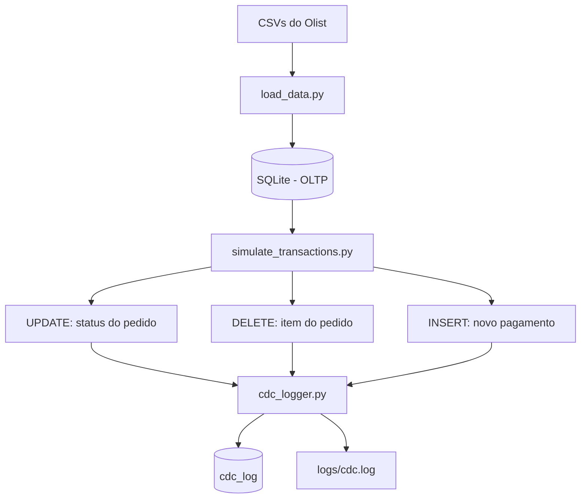

# Olist OLTP + CDC

Projeto de portfólio que simula um sistema transacional (OLTP) de e-commerce e implementa um mecanismo de **Change Data Capture (CDC) baseado na aplicação**, usando o [dataset público da Olist](https://www.kaggle.com/datasets/olistbr/brazilian-ecommerce).

Construído do zero em Python + SQLite, com foco em aprendizado profundo de modelagem relacional, boas práticas de engenharia de software e do conceito de CDC.

## Por que este projeto existe

Sistemas de e-commerce em produção mudam de estado o tempo todo: pedidos avançam de status, itens são cancelados, pagamentos são confirmados. Este projeto simula esse cenário e responde a três perguntas de negócio:

1. **Quando um pedido muda de status (ex: enviado → entregue), esse histórico fica registrado?**
2. **Se um item de pedido é cancelado, conseguimos recuperar o que existia antes do cancelamento?**
3. **Novos pagamentos entrando no sistema são capturados corretamente?**

Cada pergunta corresponde a um tipo de operação (`UPDATE`, `DELETE`, `INSERT`) simulada e capturada pelo mecanismo de CDC implementado.

## Sobre a abordagem de CDC utilizada

É importante ser preciso aqui: este projeto **não** implementa CDC no sentido em que ferramentas de mercado como o Debezium implementam — ou seja, capturando mudanças diretamente do *write-ahead log* (WAL) ou *binlog* do banco de dados, sem intervenção da aplicação.

O que foi construído é um **mecanismo de captura e registro de mudanças baseado na aplicação**: cada função que realiza uma operação de escrita (`UPDATE`, `DELETE`, `INSERT`) também é responsável por registrar explicitamente o que mudou, em uma tabela dedicada (`cdc_log`) e em um arquivo de log (`logs/cdc.log`). Essa abordagem é conceitualmente mais próxima do que se chamava *trigger-based CDC* — uma técnica mais antiga, mas ainda didaticamente valiosa para entender o problema que o CDC resolve, antes de trabalhar com ferramentas de captura baseada em log de banco em um projeto futuro.

## Arquitetura e decisões técnicas

### Escopo do schema

Do dataset completo da Olist (9 arquivos CSV), apenas 4 entidades foram modeladas como tabelas, por serem as que as perguntas de negócio realmente exigem:

| Tabela | Papel |
|---|---|
| `customers` | Clientes (identificados por pedido, não por pessoa — ver *Limitações*) |
| `orders` | Pedidos — tabela central, onde ocorre a simulação de `UPDATE` |
| `order_items` | Itens de cada pedido — onde ocorre a simulação de `DELETE` |
| `order_payments` | Pagamentos — onde ocorre a simulação de `INSERT` |

Uma quinta tabela, `cdc_log`, registra todas as mudanças capturadas.

Produtos, vendedores, geolocalização, avaliações e tradução de categorias foram deliberadamente deixados fora do escopo — não são tocados pelas perguntas de negócio deste projeto, e ficaram reservados para o Projeto 2 (Data Warehouse).

### Modelagem

- `orders`, `order_items` e `order_payments` possuem `FOREIGN KEY` para `orders`/`customers`, com integridade referencial ativa via `PRAGMA foreign_keys = ON`.
- `order_items` e `order_payments` usam **chave primária composta** (`order_id` + `order_item_id` / `payment_sequential`), já que múltiplas linhas podem pertencer ao mesmo pedido.
- Colunas que "parecem número mas não são" (como `customer_zip_code_prefix`) são tratadas explicitamente como texto na carga, evitando perda de zeros à esquerda.
- `product_id` e `seller_id` em `order_items` são mantidos como colunas simples (sem FK), já que as tabelas `products` e `sellers` não fazem parte do escopo atual.

### Formato do log de CDC

Cada mudança é registrada com: `timestamp`, `tabela`, `operação`, `identificador` da linha afetada, e o estado `antes`/`depois` (serializado como JSON). A assimetria de cada operação é respeitada:

- `UPDATE` → registra antes **e** depois
- `DELETE` → registra só o antes (a linha deixa de existir)
- `INSERT` → registra só o depois (a linha não existia antes)

## Fluxo da arquitetura



## Estrutura de pastas
```
olist-oltp-cdc/
├── data/raw/ # CSVs originais do Olist (não versionados)
├── db/ # Banco SQLite gerado (não versionado)
├── logs/ # Log de CDC em texto (não versionado)
├── src/
│ ├── create_schema.py # Cria as 5 tabelas do banco
│ ├── load_data.py # Carrega os CSVs nas tabelas de negócio
│ ├── simulate_transactions.py # Simula UPDATE, DELETE e INSERT
│ └── cdc_logger.py # Registra mudanças na tabela cdc_log e no arquivo de log
├── requirements.txt
└── README.md
```

## Como rodar o projeto

### Pré-requisitos

- Python 3.10+ instalado
- Os 9 arquivos CSV do [dataset Olist no Kaggle](https://www.kaggle.com/datasets/olistbr/brazilian-ecommerce), baixados manualmente

### Passo a passo

```bash
# 1. Clone o repositório
git clone https://github.com/gabriel-ferrari7/olist-oltp-cdc.git
cd olist-oltp-cdc

# 2. Crie e ative o ambiente virtual
python -m venv venv
.\venv\Scripts\Activate.ps1      # Windows (PowerShell)
# source venv/bin/activate       # Linux/Mac

# 3. Instale as dependências
pip install -r requirements.txt

# 4. Coloque os 9 CSVs do Olist em data/raw/

# 5. Crie o schema do banco
python src/create_schema.py

# 6. Carregue os dados
python src/load_data.py

# 7. Rode a simulação de transações (pode ser executado várias vezes)
python src/simulate_transactions.py
```

Após rodar, é possível consultar o resultado diretamente:

```bash
python -c "import sqlite3; conexao = sqlite3.connect('db/olist.sqlite'); cursor = conexao.cursor(); cursor.execute('SELECT * FROM cdc_log'); [print(l) for l in cursor.fetchall()]" 
```

## Exemplo de execução

Rodando a simulação de transações:

```bash
$ python src/simulate_transactions.py
Pedido 7c259a397799aa0b7043c30ff9d042a5 atualizado de 'shipped' para 'delivered'.
Item 1 do pedido 8462b558a3e124a93d9f7f3873028799 foi cancelado (removido).
Novo pagamento (sequencial 2) inserido para o pedido 8564eda5247ce8353cdf36e0ccd2f2c7.
```

Consultando o log de CDC gerado:

```bash
$ python -c "import sqlite3; conexao = sqlite3.connect('db/olist.sqlite'); cursor = conexao.cursor(); cursor.execute('SELECT * FROM cdc_log'); [print(l) for l in cursor.fetchall()]"
(1, '2026-09-08T17:32:34.657026', 'orders', 'UPDATE', '7c259a397799aa0b7043c30ff9d042a5', '{"order_status": "shipped"}', '{"order_status": "delivered"}')
(2, '2026-09-08T17:32:34.680074', 'order_items', 'DELETE', '8462b558a3e124a93d9f7f3873028799:1', '{"product_id": "71bd8f5de551c71f6ff1386868d57526", ...}', None)
(3, '2026-09-08T17:32:34.693972', 'order_payments', 'INSERT', '8564eda5247ce8353cdf36e0ccd2f2c7:2', None, '{"payment_type": "voucher", "payment_installments": 1, "payment_value": 50.0}')
```

Repare como cada operação (`UPDATE`, `DELETE`, `INSERT`) gera um registro correspondente no log, com o estado antes/depois preservado.

## Tecnologias utilizadas

- **Python 3** — linguagem principal
- **SQLite** (`sqlite3`, biblioteca padrão) — banco de dados transacional
- **pandas** — leitura e tratamento dos arquivos CSV
- **Git** — controle de versão

## Limitações conhecidas (decisões conscientes)

- **`customer_id` ≠ pessoa física**: no dataset Olist, `customer_id` identifica um pedido específico; `customer_unique_id` identifica o cliente através de múltiplos pedidos. Essa é uma particularidade real do dataset, preservada intencionalmente.
- **Sem FK para `products`/`sellers`**: essas tabelas não fazem parte do escopo atual; os IDs são mantidos como texto simples.
- **`identificador` composto como string**: no `cdc_log`, identificadores de tabelas com chave composta são concatenados (`order_id:item_id`) em vez de guardados em colunas separadas — uma simplificação que facilita leitura, mas dificultaria consultas programáticas mais complexas.
- **CDC baseado em aplicação, não em log de banco**: como detalhado acima, esta não é a abordagem usada em ferramentas de produção como Debezium (que leem o WAL/binlog do banco diretamente). Essa escolha foi didática, para entender o problema que o CDC resolve antes de trabalhar com ferramentas mais avançadas.
- **`ORDER BY RANDOM()`**: usado para sortear registros nas simulações. Funciona bem no volume atual (~100 mil linhas), mas não escalaria eficientemente para tabelas com dezenas de milhões de linhas.

## Próximos passos

Este é o primeiro de uma série de projetos de portfólio em engenharia de dados. Os próximos devem explorar:

- Modelagem dimensional (Star Schema) com arquitetura Medallion (Bronze/Silver/Gold)
- Uso de **PostgreSQL** como banco relacional de produção
- Pipelines de ingestão incremental (batch vs. micro-batch)

## Autor

Gabriel — projeto desenvolvido como parte de estudos em engenharia de software e engenharia de dados.